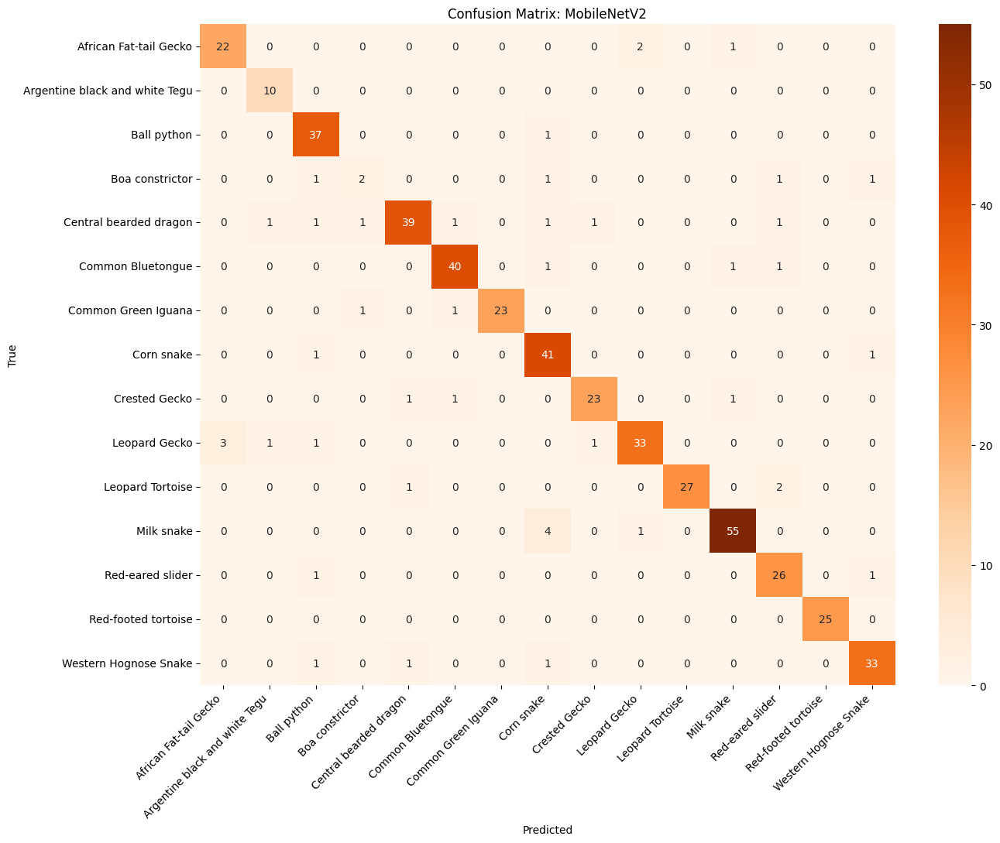
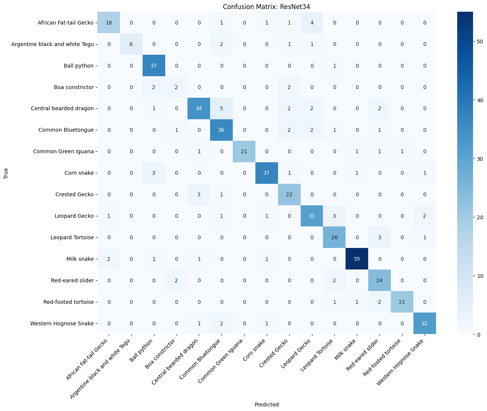

# ReptoCare — 반려 파충류 종 분류 iOS 앱

> CoreML 기반 온디바이스 AI로 반려 파충류 종을 판별하고, LLM을 통해 사육 정보를 제공하는 iOS 앱

---

## 문제 정의

반려 파충류 시장은 연평균 7.3% 성장 중이나, 강아지·고양이와 달리 종별 사육 정보를 빠르게 확인할 수 있는 모바일 서비스가 부재합니다.

본 프로젝트는 파충류 사진 한 장으로 종을 자동 분류하고, 해당 종의 사육 방법을 LLM으로 제공하는 iOS 앱을 구현합니다.

**핵심 파이프라인**
```
사진 촬영 / 갤러리 선택
        ↓
CoreML 온디바이스 추론 (종 분류)
        ↓
LLM API (사육 정보 생성)
        ↓
SwiftUI 결과 화면 렌더링
```

---

## 데이터셋

**출처**: [Roboflow — ReptilesDataset](https://universe.roboflow.com/pet-b3kq0/reptilesdataset)

| 항목 | 내용 |
|------|------|
| 전체 클래스 | 45종 |
| 사용 클래스 | **15종** (반려용 위주 필터링) |
| 원본 이미지 수 | 약 4,823장 (15종 기준) |
| Train / Valid / Test | 3,397 / 946 / 480장 |
| 이미지 포맷 | JPG, PNG |
| 라벨 구조 | 폴더 구조 (ImageFolder 호환) |

**선별 기준**: 실제 반려동물로 키우는 종 위주로 15종 선별

| 카테고리 | 종 |
|---|---|
| 도마뱀 (7종) | Leopard Gecko, African Fat-tail Gecko, Crested Gecko, Central Bearded Dragon, Common Bluetongue, Common Green Iguana, Argentine Black and White Tegu |
| 뱀 (5종) | Ball Python, Boa Constrictor, Corn Snake, Milk Snake, Western Hognose Snake |
| 거북이 (3종) | Red-eared Slider, Leopard Tortoise, Red-footed Tortoise |

---

## 전처리 방법

roboflow에서 data 가져와서, 필요한 Class만 남기기

```python
from roboflow import Roboflow
rf = Roboflow(api_key="")
project = rf.workspace("s-workspace-q8ipo").project("reptilesdataset-azlq3")
dataset_path = '/content/ReptilesDataset-1'
popular_classes = [ # 인기 파충류(내가 사용하려는) 종만 필터링
    'Leopard Gecko',
    'African Fat-tail Gecko',
    ...
    'Leopard Tortoise',
    'Red-footed tortoise'
]

# 안 쓰는 클래스(폴더)를 실제로 삭제하는 작업
deleted_count = 0

for split in ['train', 'valid', 'test']:
    split_path = os.path.join(dataset_path, split)
    if os.path.exists(split_path):
        for folder_name in os.listdir(split_path):
            if folder_name not in popular_classes: # 만약 폴더 이름이 내가 지정한 15개 인기 종 리스트에 없다면?
                target_dir = os.path.join(split_path, folder_name)
                shutil.rmtree(target_dir) # 폴더 통째로 삭제
                deleted_count += 1
```


Train 데이터에만 실시간 증강 적용 (Valid/Test는 원본 유지)

```python
train_transform = transforms.Compose([
    transforms.Resize((224, 224)),
    transforms.RandomHorizontalFlip(p=0.5),
    transforms.RandomVerticalFlip(p=0.2),
    transforms.RandomRotation(degrees=20),
    transforms.ColorJitter(brightness=0.2, contrast=0.2, saturation=0.2),
    transforms.ToTensor(),
    transforms.Normalize([0.485, 0.456, 0.406], [0.229, 0.224, 0.225])
])
```

---

## 🤖 사용 모델

### MobileNetV2
- ImageNet 사전학습 모델 기반 Transfer Learning
- 마지막 Classifier Layer를 15개 클래스로 교체
- 모델 크기: 약 14MB → iOS 온디바이스 탑재 최적화

```
Input (224×224×3)
    ↓
MobileNetV2 Backbone (Pretrained, ImageNet)
    ↓
Classifier → Linear(1280, 15)
    ↓
Output (15 classes)
```

### ResNet34
- ImageNet 사전학습 모델 기반 Transfer Learning
- FC Layer를 15개 클래스로 교체
- 모델 크기: 약 87MB

```
Input (224×224×3)
    ↓
ResNet34 Backbone (Pretrained, ImageNet)
    ↓
FC → Linear(512, 15)
    ↓
Output (15 classes)
```

---

## ⚙️ 학습 설정 (Hyperparameter)

| 항목 | 값 |
|---|---|
| Optimizer | Adam |
| Learning Rate | 0.0005 |
| Batch Size | 32 |
| Epochs | 20 |
| Loss Function | CrossEntropyLoss |
| Pretrained Weight | ImageNet1K_V1 |
| 학습 환경 | Google Colab (GPU) |

---

## 📊 성능 비교

### 최종 Test Accuracy

| 모델 | Test Accuracy | 모델 크기 |
|---|---|---|
| **MobileNetV2** | **90.83%** | 14MB |
| ResNet34 | 83.75% | 87MB |

### 성능 측정 기준
- Validation Accuracy (학습 중 매 Epoch)
- Test Accuracy (최종 평가, 모델이 한 번도 보지 않은 데이터)
- Confusion Matrix (클래스별 오분류 패턴 분석)

### MobileNetV2 Confusion Matrix
> 90.83% 달성, 데이터 부족 클래스(Boa constrictor 126장)에서 상대적으로 낮은 성능


### ResNet34 Confusion Matrix
> 83.75% 달성, 생김새가 유사한 종(Gecko 계열) 간 혼동 발생 (Leopard Gecko와 African Fat-tail Gecko 간)

>
> 
**분석 인사이트**
- 경량 모델인 MobileNetV2가 ResNet34 대비 7%p 높은 정확도 기록
- 데이터가 적은 클래스(126장)에서도 전이학습으로 최소 33% 이상 방어
- 파충류 이미지 특성상 세밀한 특징 추출보다 전반적인 패턴 인식이 효과적

---

## 📈 학습 Log

**MobileNetV2**
```

[Epoch 01] Train Loss: 0.3203 | Acc: 89.95% │ Val Loss: 0.4732 | Acc: 86.22% │ 소요시간: 580.8초
[Epoch 02] Train Loss: 0.2735 | Acc: 91.31% │ Val Loss: 0.4165 | Acc: 88.29% │ 소요시간: 564.0초
[Epoch 03] Train Loss: 0.2239 | Acc: 93.45% │ Val Loss: 0.4047 | Acc: 87.49% │ 소요시간: 576.9초
[Epoch 04] Train Loss: 0.2077 | Acc: 93.07% │ Val Loss: 0.3857 | Acc: 89.09% │ 소요시간: 559.7초
[Epoch 05] Train Loss: 0.1647 | Acc: 94.74% │ Val Loss: 0.3793 | Acc: 88.75% │ 소요시간: 598.2초
[Epoch 06] Train Loss: 0.1687 | Acc: 94.47% │ Val Loss: 0.3899 | Acc: 89.55% │ 소요시간: 589.5초
[Epoch 07] Train Loss: 0.1199 | Acc: 96.03% │ Val Loss: 0.4360 | Acc: 89.21% │ 소요시간: 592.6초
[Epoch 08] Train Loss: 0.1321 | Acc: 95.96% │ Val Loss: 0.4146 | Acc: 88.63% │ 소요시간: 599.7초
[Epoch 09] Train Loss: 0.1257 | Acc: 95.99% │ Val Loss: 0.4492 | Acc: 87.72% │ 소요시간: 602.0초
[Epoch 10] Train Loss: 0.1189 | Acc: 96.10% │ Val Loss: 0.3757 | Acc: 89.78% │ 소요시간: 606.5초
[Epoch 11] Train Loss: 0.1181 | Acc: 96.16% │ Val Loss: 0.3657 | Acc: 89.90% │ 소요시간: 595.9초
[Epoch 12] Train Loss: 0.0815 | Acc: 97.59% │ Val Loss: 0.3626 | Acc: 90.93% │ 소요시간: 582.6초
[Epoch 13] Train Loss: 0.1102 | Acc: 96.81% │ Val Loss: 0.4858 | Acc: 87.26% │ 소요시간: 583.9초
[Epoch 14] Train Loss: 0.1241 | Acc: 95.79% │ Val Loss: 0.4299 | Acc: 88.75% │ 소요시간: 586.3초
[Epoch 15] Train Loss: 0.1354 | Acc: 95.93% │ Val Loss: 0.4324 | Acc: 88.06% │ 소요시간: 579.1초
[Epoch 16] Train Loss: 0.1049 | Acc: 96.91% │ Val Loss: 0.4614 | Acc: 87.94% │ 소요시간: 589.9초
[Epoch 17] Train Loss: 0.1014 | Acc: 97.08% │ Val Loss: 0.5137 | Acc: 87.37% │ 소요시간: 588.4초
[Epoch 18] Train Loss: 0.1074 | Acc: 96.64% │ Val Loss: 0.5157 | Acc: 87.83% │ 소요시간: 583.2초
[Epoch 19] Train Loss: 0.1119 | Acc: 96.64% │ Val Loss: 0.4980 | Acc: 86.57% │ 소요시간: 582.7초
[Epoch 20] Train Loss: 0.0901 | Acc: 96.91% │ Val Loss: 0.4598 | Acc: 88.86% │ 소요시간: 592.2초

```

**ResNet34**
```

[Epoch 01] Train Loss: 1.3082 | Acc: 59.22% │ Val Loss: 1.1926 | Acc: 64.75% │ 소요시간: 1562.6초
[Epoch 02] Train Loss: 0.9177 | Acc: 70.56% │ Val Loss: 1.7752 | Acc: 55.45% │ 소요시간: 1539.4초
[Epoch 03] Train Loss: 0.7610 | Acc: 76.10% │ Val Loss: 1.0130 | Acc: 69.23% │ 소요시간: 1546.2초
[Epoch 04] Train Loss: 0.6705 | Acc: 78.85% │ Val Loss: 1.0064 | Acc: 70.95% │ 소요시간: 1553.4초
[Epoch 05] Train Loss: 0.5463 | Acc: 82.48% │ Val Loss: 0.7669 | Acc: 77.73% │ 소요시간: 1566.0초
[Epoch 06] Train Loss: 0.4675 | Acc: 85.23% │ Val Loss: 1.3534 | Acc: 65.10% │ 소요시간: 1541.8초
[Epoch 07] Train Loss: 0.5252 | Acc: 84.14% │ Val Loss: 1.4772 | Acc: 64.52% │ 소요시간: 1533.8초
[Epoch 08] Train Loss: 0.4191 | Acc: 86.79% │ Val Loss: 0.9154 | Acc: 75.77% │ 소요시간: 1553.7초
[Epoch 09] Train Loss: 0.3651 | Acc: 88.76% │ Val Loss: 0.7820 | Acc: 78.19% │ 소요시간: 1542.5초
[Epoch 10] Train Loss: 0.3437 | Acc: 88.62% │ Val Loss: 0.6730 | Acc: 80.25% │ 소요시간: 1546.7초
[Epoch 11] Train Loss: 0.3206 | Acc: 89.51% │ Val Loss: 0.5853 | Acc: 82.20% │ 소요시간: 1543.3초
[Epoch 12] Train Loss: 0.2901 | Acc: 90.97% │ Val Loss: 0.8037 | Acc: 76.81% │ 소요시간: 1550.2초
[Epoch 13] Train Loss: 0.2985 | Acc: 90.59% │ Val Loss: 0.6918 | Acc: 81.86% │ 소요시간: 1563.0초
[Epoch 14] Train Loss: 0.2540 | Acc: 92.02% │ Val Loss: 0.9172 | Acc: 78.07% │ 소요시간: 1550.5초
[Epoch 15] Train Loss: 0.2792 | Acc: 91.14% │ Val Loss: 0.8672 | Acc: 78.42% │ 소요시간: 1540.2초
[Epoch 16] Train Loss: 0.2354 | Acc: 92.39% │ Val Loss: 0.5819 | Acc: 84.16% │ 소요시간: 1554.4초
[Epoch 17] Train Loss: 0.2477 | Acc: 91.88% │ Val Loss: 0.7773 | Acc: 80.37% │ 소요시간: 1553.5초
[Epoch 18] Train Loss: 0.2264 | Acc: 92.97% │ Val Loss: 0.7983 | Acc: 81.63% │ 소요시간: 1552.6초

```
---

## 🍎 CoreML 변환

PyTorch → CoreML 변환 파이프라인

```python
# TorchScript 변환 후 CoreML로 export
traced = torch.jit.trace(wrapped_model, dummy_input)
mlmodel = ct.convert(
    traced,
    inputs=[ct.ImageType(name="input_1", shape=(1,3,224,224), ...)],
    classifier_config=ct.ClassifierConfig(class_labels),
)
mlmodel.save("MobileNetV2.mlpackage")
```

| 항목 | 내용 |
|---|---|
| 변환 도구 | coremltools 9.0 |
| 출력 포맷 | .mlpackage (iOS 15+) |
| 정규화 | CoreMLWrapper로 모델 내부에 포함 |
| 최소 타겟 | iOS 15 |

---
## 📱 iOS 앱 구조
<!-- 숨길거에요
```
ReptoCare/
├── ContentView.swift       # 메인 화면 (사진 선택/촬영)
├── ClassifierView.swift    # 분류 결과 화면
├── CareInfoView.swift      # LLM 사육 정보 화면
├── MLClassifier.swift      # CoreML 추론 로직
├── LLMService.swift        # LLM API 연동
├── Models/
│   ├── MobileNetV2.mlpackage
│   └── ResNet34.mlpackage
└── Assets.xcassets
```
-->
**기술 스택**

| 항목 | 기술 |
|---|---|
| UI | SwiftUI |
| ML 추론 | CoreML, Vision Framework |
| 카메라/갤러리 | AVFoundation, PhotosUI |
| LLM 연동 | Gemini API |
| 최소 지원 | iOS 15+ |

---

<!-- 숨길거에요
## 🗂️ 코드 구조

```
ReptoCare/
├── Colab/
│   ├── 01_data_download.ipynb      # 데이터 다운로드 및 필터링
│   ├── 02_train.ipynb              # 전이학습 (MobileNetV2, ResNet34)
│   └── 03_coreml_convert.ipynb     # CoreML 변환
├── iOS/
│   └── ReptoCare/                  # Xcode 프로젝트
└── README.md
```

---


## 🛠️ 실행 방법

**Colab 학습**
```bash
# 1. 데이터 다운로드
pip install roboflow
# Roboflow API로 데이터셋 다운로드

# 2. 학습
# 02_train.ipynb 실행

# 3. CoreML 변환
pip install coremltools
# 03_coreml_convert.ipynb 실행
```

**iOS 앱 실행**
```
1. Xcode에서 ReptoCare.xcodeproj 열기
2. MobileNetV2.mlpackage, ResNet34.mlpackage 추가
3. 실기기 또는 시뮬레이터에서 실행
```
---
<!-- 숨길거에요
## 👤 개발자

- **강찬휘** | iOS Developer
- GitHub: [링크]
-->
